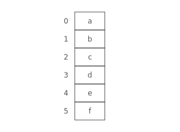
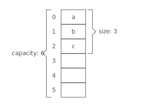
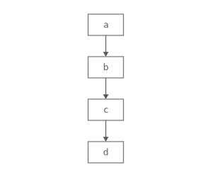
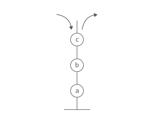
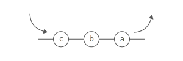
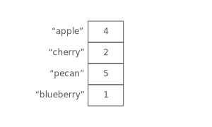
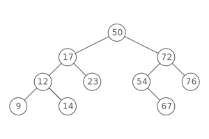
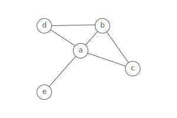

# Basic Data Structures and Algorithms

This list is inspired by the original gist of [TSiege](https://gist.github.com/TSiege/cbb0507082bb18ff7e4b), [The InterviewCake](https://www.interviewcake.com/data-structures-reference), the classes of [William Fisset](https://www.youtube.com/playlist?list=PLDV1Zeh2NRsB6SWUrDFW2RmDotAfPbeHu) and various others sources on the internet.

First we must define the difference between an Abstract Data Type and Data Structures :

- An abstract data type is an abstraction of a data structure which provides only the interface to which a data structure must adhere to. The interface does not give any specific details about how something should be implemented or in what programming languages.

- A data structure is a collection of data types, how those data types interact internally, and any associated operations on them from the outside world. We talk about the cohesion of the elements of a data structure and the importance of coupling with other data structures in a system so we know where to set up the boundaries and define our rules for data hiding. In short, the data structure is very concrete and practical.

## Data Structure Fundamentals

### **Static Arrays**



#### Definition:

> An array organizes items sequentially, one after another in memory. Each position in the array has an index, starting at 0. It is one of the oldest, most commonly used data structures.

#### Strength:

- **Fast lookups**. Retrieving the element at a given index takes O(1) time, regardless of the length of the array.

#### Weakness:

- **Fixed size**. You need to specify how many elements you're going to store in your array ahead of time. (Unless you're using a fancy dynamic array.)

#### Basic Operations:

Following are the basic operations supported by an array.

- Traverse − print all the array elements one by one.
- Search − Searches an element using the given index or by the value.
- Update − Updates an element at the given index.

#### Big O analysis:

- Access: O(1),
- Search: O(n),
- Optimized Search (binary): O(log n),
- Insertion: N/A
- Deletion: N/A

### **Dynamic Arrays**



#### Definition:

> One limitation of arrays is that they're fixed size, meaning you need to specify the number of elements your array will hold ahead of time.
> A dynamic array expands as you add more elements. So you don't need to determine the size ahead of time.

#### Strengths:

- **Fast lookups**. Just like arrays, retrieving the element at a given index takes O(1) time.
- **Variable size**. You can add as many items as you want, and the dynamic array will expand to hold them.
- **Cache-friendly**. Just like arrays, dynamic arrays place items right next to each other in memory, making efficient use of caches.

#### Weaknesses:

- **Slow worst-case appends**. Usually, adding a new element at the end of the dynamic array takes O(1) time. But if the dynamic array doesn't have any room for the new item, it'll need to expand, which takes O(n) time.
- **Costly inserts and deletes**. Just like arrays, elements are stored adjacent to each other. So adding or removing an item in the middle of the array requires "scooting over" other elements, which takes O(n) time

#### Basic Operations:

Following are the basic operations supported by an array.

- Traverse − print all the array elements one by one.
- Insertion − Adds an element at the given index.
- Deletion − Deletes an element at the given index.
- Search − Searches an element using the given index or by the value.
- Update − Updates an element at the given index.

#### Big O analysis:

- Access: O(1),
- Search: O(n),
- Optimized Search (binary): O(log n),
- Insertion: O(n)
- Appending: O(n)
- Deletion: O(n)

#### [Link to common exercises on Arrays](https://leetcode.com/tag/array/)

### **Linked List**



#### Definition:

> A linked list organizes items sequentially, with each item storing a pointer to the next one. An item in a linked list is called a **node**. The first node is called the **head**. The last node is called the **tail**.

#### Strengths:

- **Fast operations on the ends**. Adding elements at either end of a linked list is O(1). Removing the first element is also O(1).
- **Flexible size**. There's no need to specify how many elements you're going to store ahead of time. You can keep adding elements as long as there's enough space on the machine.

#### Weaknesses:

- **Costly lookups**. To access or edit an item in a linked list, you have to take O(i) time to walk from the head of the list to the iith item.

#### Basic operations:

- Insertion − Adds an element at the beginning of the list.
- Deletion − Deletes an element at the beginning of the list.
- Display − Displays the complete list.
- Search − Searches an element using the given key.
- Delete − Deletes an element using the given key.

#### Types of Linked lists:

- **Simple Linked List** − Item navigation is forward only.
- **Doubly Linked List** − Items can be navigated forward and backward.
- **Circular Linked List** − Last item contains link of the first element as next and the first element has a link to the last element as previous.

#### Big O analysis:

- Append / prepend: O(1)
- Delete: O(n)
- Lookup: O(n)
- Insertion: O(n)

#### [Link to common exercises on Linked Lists](https://leetcode.com/tag/linked-list/)

### **Stack**



#### Definition:

> A stack is an Abstract Data Type (ADT), commonly used in most programming languages. This feature makes it LIFO data structure. LIFO stands for Last-in-first-out.

#### Strengths:

- **Fast operations**. All stack operations take O(1) time. Note that it's the main DS behind Depth-First-Search.

#### Basic operations:

- Insertion − Pushing (storing) an element on the stack (push method).
- Deletion − Removing (accessing) an element from the stack (pop method).
- Last-element lookup − Accessing top of the stack element (peek method)

#### Big O analysis:

- pop: O(1)
- peek: O(1)
- push: O(1)

#### [Link to common exercises on Stacks](https://leetcode.com/tag/stack/)

### **Queue**



#### Definition:

> Queue is an abstract data structure, somewhat similar to Stacks. Unlike stacks, a queue is open at both its ends. One end is always used to insert data (enqueue) and the other is used to remove data (dequeue). Queue follows First-In-First-Out methodology, i.e., the data item stored first will be accessed first.

#### Strengths:

- **Fast operations**. All queue operations take O(1) time. Note that it's the main DS behind Depth-First-Search.

#### Basic operations:

- Insertion − add (store) an item to the queue (enqueue method).
- Deletion − remove (access) an item from the queue (dequeue method).
- Last-element lookup − Gets the element at the front of the queue without removing it (peek method).

#### Big O analysis:

- enqueue: O(1)
- peek: O(1)
- dequeue: O(1)

#### [Link to common exercises on Queues](https://leetcode.com/tag/queue/)

### **Hash Table or Maps**



#### Definition:

> A data structure that implements an associative array abstract data type, a structure that can map keys to values. A hash table uses a hash function to compute an index into an array of buckets or slots, from which the desired value can be found.

#### Strengths:

- **Fast lookups**. Lookups take O(1) time on average.
- **Flexible keys**. Most data types can be used for keys, as long as they're hashable.

#### Weaknesses:

- **Slow worst-case lookups**. Lookups take O(n) time in the worst case.
- **Unordered**. Keys aren't stored in a special order. If you're looking for the smallest key, the largest key, or all the keys in a range, you'll need to look through every key to find it.
- **Single-directional lookups**. While you can look up the value for a given key in O(1) time, looking up the keys for a given value requires looping through the whole dataset — O(n) time.
- **Not cache-friendly**. Many hash table implementations use linked lists, which don't put data next to each other in memory.

#### Worst case (hash collision):

What if two keys hash to the same index in our array?
This is called a **hash collision**. There are a few different strategies for dealing with them.

Here's a common one: instead of storing the actual values in our array, let's have each array slot hold a pointer to a linked list holding the values for all the keys that hash to that index.

If all our keys caused hash collisions, we'd be at risk of having to walk through all of our values for a single lookup (in the example above, we'd have one big linked list). This is unlikely, but it could happen. That's the worst case O(n).

#### Big O analysis:

- Lookup: O(1) (worst case is O(n))
- Delete: O(1) (worst case is O(n))
- Insertion: O(1) (worst case is O(n))

#### [Link to common exercises on Hash Tables](https://leetcode.com/tag/hash-table/)

### **Trees and Binary Search Tree**



#### Definition:

> Tree represents the nodes connected by edges. We will discuss binary tree or binary search tree specifically. Binary Tree is a special data structure used for data storage purposes. A binary tree has a special condition that each node can have a maximum of two children. A Binary Search Tree (BST) is a tree in which all the nodes follow the below-mentioned properties:
>
> - The left sub-tree of a node has a key less than or equal to its parent node's key.
> - The right sub-tree of a node has a key greater than to its parent node's key.

#### Basic operations:

- Insert − Inserts an element in a tree/create a tree.
- Delete − deletes an element in a tree/deletes a tree.
- Search − Searches an element in a tree.
- Preorder Traversal − Traverses a tree in a pre-order manner.
- Inorder Traversal − Traverses a tree in an in-order manner.
- Postorder Traversal − Traverses a tree in a post-order manner.

#### Big O analysis:

- Indexing: Binary Search Tree: O(log n) (worst case O(n))
- Search: Binary Search Tree: O(log n) (worst case O(n))
- Insertion: Binary Search Tree: O(log n) (worst case O(n))

#### [Link to common exercises on Trees](https://leetcode.com/tag/tree/)

### **Graphs**



#### Definition:

> A graph is a pictorial representation of a set of objects where some pairs of objects are connected by links. The interconnected objects are represented by points termed as vertices, and the links that connect the vertices are called edges.

#### Strengths:

- **Representing links**. Graphs are ideal for cases where you're working with things that connect to other things. Nodes and edges could, for example, respectively represent cities and highways, routers and ethernet cables, or Facebook users and their friendships.

#### Weaknesses:

- **Scaling challenges.** Most graph algorithms are O(nlog(n)) or even slower. Depending on the size of your graph, running algorithms across your nodes may not be feasible.

#### Basic operations:

- Add Vertex − Adds a vertex to the graph.
- Add Edge − Adds an edge between the two vertices of the graph.
- Display Vertex − Displays a vertex of the graph.

#### Big O analysis (adjacency list):

- Add enge / vertex: O(1)
- Remove vertex: O(|V| + |E|)
- Remove edge: O(|E|)

#### [Link to common exercises on Graphs](https://leetcode.com/tag/graph/)

# Search Basics

###**Breadth First Search**
####Definition:

- An algorithm that searches a tree (or graph) by searching levels of the tree first, starting at the root.
  - It finds every node on the same level, most often moving left to right.
  - While doing this it tracks the children nodes of the nodes on the current level.
  - When finished examining a level it moves to the left most node on the next level.
  - The bottom-right most node is evaluated last (the node that is deepest and is farthest right of it's level).

####What you need to know:

- Optimal for searching a tree that is wider than it is deep.
- Uses a queue to store information about the tree while it traverses a tree.

  - Because it uses a queue it is more memory intensive than **depth first search**.
  - The queue uses more memory because it needs to stores pointers

####Big O efficiency:

- Search: Breadth First Search: O(|E| + |V|)
- E is number of edges
- V is number of vertices

###**Depth First Search**
####Definition:

- An algorithm that searches a tree (or graph) by searching depth of the tree first, starting at the root.

  - It traverses left down a tree until it cannot go further.
  - Once it reaches the end of a branch it traverses back up trying the right child of nodes on that branch, and if possible left from the right children.
  - When finished examining a branch it moves to the node right of the root then tries to go left on all it's children until it reaches the bottom.
  - The right most node is evaluated last (the node that is right of all it's ancestors).

####What you need to know:

- Optimal for searching a tree that is deeper than it is wide.
- Uses a stack to push nodes onto.

  - Because a stack is LIFO it does not need to keep track of the nodes pointers and is therefore less memory intensive than breadth first search.
  - Once it cannot go further left it begins evaluating the stack.

####Big O efficiency:

- Search: Depth First Search: O(|E| + |V|)
- E is number of edges
- V is number of vertices

####Breadth First Search Vs. Depth First Search

- The simple answer to this question is that it depends on the size and shape of the tree.
  - For wide, shallow trees use Breadth First Search
  - For deep, narrow trees use Depth First Search

####Nuances:

- Because BFS uses queues to store information about the nodes and its children, it could use more memory than is available on your computer. (But you probably won't have to worry about this.)
- If using a DFS on a tree that is very deep you might go unnecessarily deep in the search. See [xkcd](http://xkcd.com/761/) for more information.
- Breadth First Search tends to be a looping algorithm.
- Depth First Search tends to be a recursive algorithm.

## Efficient Sorting Basics

###**Merge Sort**
####Definition:

- A comparison based sorting algorithm
  - Divides entire dataset into groups of at most two.
  - Compares each number one at a time, moving the smallest number to left of the pair.
  - Once all pairs sorted it then compares left most elements of the two leftmost pairs creating a sorted group of four with the smallest numbers on the left and the largest ones on the right.
  - This process is repeated until there is only one set.

####What you need to know:

- This is one of the most basic sorting algorithms.
- Know that it divides all the data into as small possible sets then compares them.

####Big O efficiency:

- Best Case Sort: Merge Sort: O(n)
- Average Case Sort: Merge Sort: O(n log n)
- Worst Case Sort: Merge Sort: O(n log n)

###**Quicksort**
####Definition:

- A comparison based sorting algorithm
  - Divides entire dataset in half by selecting the average element and putting all smaller elements to the left of the average.
  - It repeats this process on the left side until it is comparing only two elements at which point the left side is sorted.
  - When the left side is finished sorting it performs the same operation on the right side.
- Computer architecture favors the quicksort process.

####What you need to know:

- While it has the same Big O as (or worse in some cases) many other sorting algorithms it is often faster in practice than many other sorting algorithms, such as merge sort.
- Know that it halves the data set by the average continuously until all the information is sorted.

####Big O efficiency:

- Best Case Sort: Merge Sort: O(n)
- Average Case Sort: Merge Sort: O(n log n)
- Worst Case Sort: Merge Sort: O(n^2)

###**Bubble Sort**
####Definition:

- A comparison based sorting algorithm
  - It iterates left to right comparing every couplet, moving the smaller element to the left.
  - It repeats this process until it no longer moves and element to the left.

####What you need to know:

- While it is very simple to implement, it is the least efficient of these three sorting methods.
- Know that it moves one space to the right comparing two elements at a time and moving the smaller on to left.

####Big O efficiency:

- Best Case Sort: Merge Sort: O(n)
- Average Case Sort: Merge Sort: O(n^2)
- Worst Case Sort: Merge Sort: O(n^2)

####Merge Sort Vs. Quicksort

- Quicksort is likely faster in practice.
- Merge Sort divides the set into the smallest possible groups immediately then reconstructs the incrementally as it sorts the groupings.
- Quicksort continually divides the set by the average, until the set is recursively sorted.

## Basic Types of Algorithms

###**Recursive Algorithms**
####Definition:

- An algorithm that calls itself in its definition.
  - **Recursive case** a conditional statement that is used to trigger the recursion.
  - **Base case** a conditional statement that is used to break the recursion.

####What you need to know:

- **Stack level too deep** and **stack overflow**.
  - If you've seen either of these from a recursive algorithm, you messed up.
  - It means that your base case was never triggered because it was faulty or the problem was so massive you ran out of RAM before reaching it.
  - Knowing whether or not you will reach a base case is integral to correctly using recursion.
  - Often used in Depth First Search

###**Iterative Algorithms**
####Definition:

- An algorithm that is called repeatedly but for a finite number of times, each time being a single iteration.
  - Often used to move incrementally through a data set.

####What you need to know:

- Generally you will see iteration as loops, for, while, and until statements.
- Think of iteration as moving one at a time through a set.
- Often used to move through an array.

####Recursion Vs. Iteration

- The differences between recursion and iteration can be confusing to distinguish since both can be used to implement the other. But know that,
  - Recursion is, usually, more expressive and easier to implement.
  - Iteration uses less memory.
- **Functional languages** tend to use recursion. (i.e. Haskell)
- **Imperative languages** tend to use iteration. (i.e. Ruby)
- Check out this [Stack Overflow post](http://stackoverflow.com/questions/19794739/what-is-the-difference-between-iteration-and-recursion) for more info.

####Pseudo Code of Moving Through an Array (this is why iteration is used for this)

```
| Recursion                    | Iteration                     |
| ---------------------------- | ----------------------------- |
| recursive method (array, n)  | iterative method (array)      |
| if array[n] is not nil       | for n from 0 to size of array |
| print array[n]               | print(array[n])               |
| recursive method(array, n+1) |
| else                         |
| exit loop                    |
```

###**Greedy Algorithm**
####Definition:

- An algorithm that, while executing, selects only the information that meets a certain criteria.
- The general five components, taken from [Wikipedia](http://en.wikipedia.org/wiki/Greedy_algorithm#Specifics):
  - A candidate set, from which a solution is created.
  - A selection function, which chooses the best candidate to be added to the solution.
  - A feasibility function, that is used to determine if a candidate can be used to contribute to a solution.
  - An objective function, which assigns a value to a solution, or a partial solution.
  - A solution function, which will indicate when we have discovered a complete solution.

####What you need to know:

- Used to find the optimal solution for a given problem.
- Generally used on sets of data where only a small proportion of the information evaluated meets the desired result.
- Often a greedy algorithm can help reduce the Big O of an algorithm.

####Pseudo Code of a Greedy Algorithm to Find Largest Difference of any Two Numbers in an Array.

```
greedy algorithm (array)
  var largest difference = 0
  var new difference = find next difference (array[n], array[n+1])
  largest difference = new difference if new difference is > largest difference
  repeat above two steps until all differences have been found
  return largest difference
```

This algorithm never needed to compare all the differences to one another, saving it an entire iteration.
